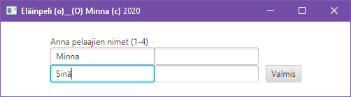

# Eläinpeli - still in beta :)
[Readme in English](README.en.md)

Ostin tytölle (silloin 1,5 v) jouluksi muutamia puuleluja. Yhdessä niistä kootaan viisi eläintä palasista. 
Ohjeissa sanotaan, että se on peli, mutta minusta siinä ei ole mitään pelillistä. Keksin, että jos siihen 
lisäisi nopan, joka määrää, minkä eläimen palan saa laittaa "pelilaudalle", se kävisi jo pelistä.

## Pelin säännöt
Pelissä on 1-4 pelaajaa (yksin toki vähän turha pelata eli myöhemmässä versiossa on tietokonevastustaja!). 
Vuorollaan pelaajat heittävät noppaa. Sen silmäluku määrää, mille eläimelle pelaaja saa lisätä palan:
1. Sammakko
2. Ankka
3. Possu
4. Lehmä
5. Hevonen
6. Pelaaja saa valita itse

Eläimet ovat eri kokoisia: sammakko koostuu yhdestä palasta, ankka kahdesta jne. Kun pelaaja saa eläimen valmiiksi, 
hän saa siitä pisteen. Kun kaikki eläimet ovat valmiina, ohjelma kertoo voittajan.

## Kuvia
Piirtelin eläinten päät käsin Chromebookilla ja väritin ihan perus-Paintilla (Windows 10:n Paint 3D tosin). En väitä olevani taiteilija. :see_no_evil:

## Käyttö
Zipissä on exe ja sen käytön edellyttämä satsi JAR-tiedostoja. En takaa, että toimii siltikään...

## Versiot
* 0.1 - Java, tekstipohjainen
* 0.2 - Java, graafinen käyttöliittymä (JavaFX)

# Projektini

(nämä seuraavat muuten varmaan menevät väärin, koska en puhu sujuvaa bisnestä :smile: )
## Visio
Toivon oppivani ohjelmointia ja löytäväni itselleni sopivan paikan IT-maailmasta; sitä varten tässä aloittelen omaa portfoliota.

## Missio
Haluan tutustua syvemmin matkan varrella oppimiini kieliin/teknologioihin toteuttamalla pelin niillä.

## Strategia
[Ohjelmoinnin MOOC -peruskurssin](https://ohjelmointi-20.mooc.fi/) jälkeen tein ohjelmasta ensimmäisen, Java-kielisen version (v0.1), jota jatkokehitin samaisen MOOC:in jatkokurssin päätyttyä (v0.2). Seuraavaksi saattaisi olla vuorossa jokin [Full Stack Open -kurssin](https://fullstackopen.com/) tekniikoista.
